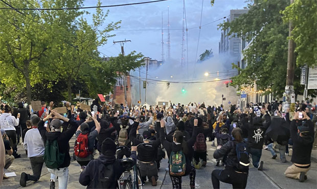

# Assignment 1: Protests
The past few years in the United States, there has been a surge in protests in support of Black Lives Matter, gender equity, and other social issues. In this assignment, you'll work with data from [CountLove](https://countlove.org/) -- the same data often [cited](https://www.nytimes.com/2020/08/28/us/black-lives-matter-protest.html) by the New York Times -- to learn more about demonstrations over the past few years. 

By completing the assignment, you will demonstrate the following skills:

- Use of **version control** for managing your code
- Declaring document rendering using **markdown** syntax
- Foundational programming skills in R. 

## Background Research
Before diving into this (or any) dataset, it's important to have _domain familiarity_ (i.e., to know something about the topic). As preparation, I'm asking that you read **three articles** about protests in the U.S., and provide a brief 1 - 2 sentence summary or takeaway from each one. 

In the section below, create an **unordered list** of the three articles you found. Make sure to provide an appropriate markdown link (_not_ just the URL) to the article in addition to your 1 - 2 sentence summary. 

First article: George Floyd: Huge protests against racism held across US
    [George Floyd Article](https://www.bbc.com/news/world-us-canada-52951093)
    Summary: Huge peaceful rallies have taken place across the US against racism and police brutality on the 12th day of protests sparked by the death of George Floyd.
Second article: Black Lives Matter Movement
    [Black Lives Matter Movement](https://www.nytimes.com/interactive/2020/07/03/us/george-floyd-protests-crowd-size.html)
    Summary: Violent intervention from government forces did not make protests more peaceful, the report concluded. In Portland specifically, the report found that intervention from federal authorities in the protest “only aggravated unrest”, with the number of “violent demonstrations” rising from 53% to nearly 62% of all events “after federal agents arrived on the scene”.
Third article:Anger erupts in American cities after charging decision in Breonna Taylor case
    [News](https://www.cnn.com/2020/09/28/us/weekend-protests-breonna-taylor/index.html)
    Summary: Protesters in Kentucky are on hunger strike demanding justice for Breonna Taylor, a black woman killed by police in her home in March. Anger over lack of direct charges for police officers spurs new demonstrations in Louisville and across US

## Accompanying Image 
In this section, please **display one image** to accompany your text, and describe _why_ you included it (~2 - 3 sentences). This will require that you download an image into your project folder. In your description, use **bold** and _italics_ (at least once, for practice) to emphasize some of your points.

Why I included it: This shows **The Capitol Hill Autonomous Zone** _(CHAZ)_,also known as Free Capitol Hill. Seattle-area protests: Protesters remain on Capitol Hill on seventh day of action after George Floyd’s killing.

## Analysis
At this point, you should open up your `analysis.R` script to begin working with the data. The script will guide you through an initial analysis of the data. Throughout the script, there are prompts labeled **Reflection**. Please write 1 - 2 sentences for each of these reflections below:

- What does the difference between the mean and the median tell you about the *distribution* of the data?
The difference between the mean and the median shows that mean is greater than the median, the distribution is positively skewed. 
- Does the number of protests in Washington surprise you? Why or why not?
The number of protests (1275) in Washington surprised me because that 1275 is a large number. Over the past four years, there are around 318 protests per year. That is about one protest per day!      
- Looking at the `state_table` variable, what data quality issues do you notice, and how would you use that to change your analysis (no need to actually change your analysis)?
Some state's name are not capitalized and the overall table seems unorganized.I would use toupper() method to convert lowercase string to uppercase string.
- Does the change in the number of protests from 2019 to 2020 surprise you? Why or why not?
Yes, because the number of protests in 2020 is two times the number of protests in 2019. I wonder what is the main cause of more than doubled the number of protests in 2020.
- Do a bit of research. Find at least *two specific policies* that have been changed as a result of protests in 2020. These may be at the city, state, or University level. Please provide a basic summary, as well as a link to each article.
[Denver policy change](https://www.thedenverchannel.com/news/local-news/denver-police-update-policies-to-ban-chokeholds-require-body-cam-use-for-swat-more-reporting-for-officers) In Denver, police announced a series of policy changes, including a ban on chokeholds, requiring officers to report anytime they point a gun at someone, and mandating that SWAT officers turn on their body cameras during tactical operations.
[Executive order on Safe Policing for Safe Comunities](https://ballotpedia.org/Changes_to_policing_policy_in_the_states_and_100_largest_cities,_2020) The order titled Executive Order on Safe Policing for Safe Communities directed the U.S. Department of justice to create an independent credentialing body that would develop a set of criteria for state and local law enforcement agencies to meet in order to be awarded federal grants. The order stated that the criteria should address excessive use of force, include de-escalation training, and ban the use of chokeholds, except when the use of deadly force is lawful.
- Take a look (`View()`) your `high_level_table` variable. What picture does this paint of the U.S.?
Civil rights, guns, immigration, and racial injustice are topics that most people have protests for. The number one frequent purpose is on guns. Recently, people are protesting for topic around racial injustice.

## Final Thoughts
When you are finished, with your analysis, please answer the following questions in 1-2 sentences each. 

- What about the analysis surprised you?
The number of protests in Washington surprised me and the number of protests in 2020 surged. It is two times the number of protests in 2019 potentially due to COVID and Black Lives Matter.
- What parts of this analysis did you find challenging?
It was challenging to work on Part 4: dates. It took a lot of googling and trial and error to figure out.  
- What types of analysis do you wish you were able to do with the dataset, but currently don't have the technical skills to do?
I wish I can make a table that sort out these data points based on which tags
include the most attendees (from most to least), and show correlated location, date, source, and total articles. From the table, we can see which tags the majority of the people are protesting for and see the location where it happened.